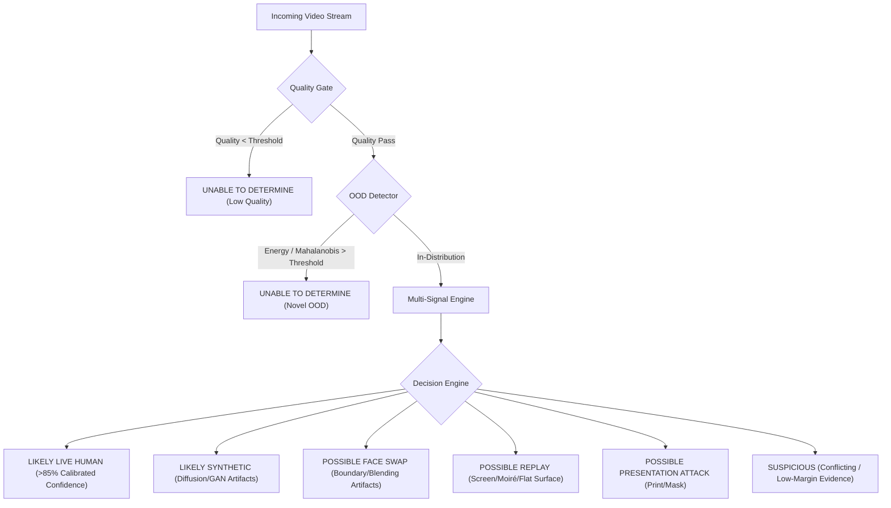

# Privacy Eye — Enterprise Dataset System & Forensic Liveness Architecture
**Version**: 2.0-Production-Spec  
**Author**: Privacy Eye AI Research & Security Architecture Team  
**System Target**: Real-time Human Face Authenticity, Presentation Attack Detection (PAD), Deepfake Forensics, and Generator-Generalizing Defense

---

## Executive Summary & Architectural Axiom

Privacy Eye is built upon the foundational principle: **"Abstain with 'UNABLE TO DETERMINE' rather than emit false certainty on degraded or out-of-distribution inputs."**

Standard commercial face biometric detectors frequently suffer from catastrophic generalization failures:
1. Relying on simplistic binary signals (e.g., blink detection, smile response, single-frame deepfake classifiers).
2. Conflating image corruption (low light, motion blur, compression) with synthetic manipulation (*the "poor quality = fake" fallacy*).
3. Suffering from severe benchmark data leakage (randomly splitting consecutive video frames or identity subjects across train/test sets).
4. Emitting overconfident raw softmax scores without empirical uncertainty calibration.

This document establishes the architecture for Privacy Eye's **Five-Category Dataset System**, **Subject/Generator/Device-Disjoint Splits**, **Two-Stage Multi-Signal Liveness Engine**, and **Continuous Human-in-the-Loop Failure Mining Loop**.

---

## Table of Deliverables (The 24 Research Deliverables)

1. [Dataset Inventory & Taxonomy](#1-dataset-inventory--taxonomy)
2. [Dataset Licensing Matrix](#2-dataset-licensing-matrix)
3. [Data Collection Protocol & Ethics](#3-data-collection-protocol--ethics)
4. [Label Taxonomy & Hierarchical State Space](#4-label-taxonomy--hierarchical-state-space)
5. [Subject-Disjoint Split Strategy](#5-subject-disjoint-split-strategy)
6. [Generator-Disjoint Evaluation Strategy](#6-generator-disjoint-evaluation-strategy)
7. [Device-Disjoint Evaluation Strategy](#7-device-disjoint-evaluation-strategy)
8. [Probabilistic Data Augmentation Pipeline](#8-probabilistic-data-augmentation-pipeline)
9. [Multi-Signal Model Architecture (Spatial, Temporal, Liveness, Replay)](#9-multi-signal-model-architecture)
10. [Model Ensemble & Evidence Fusion Strategy](#10-model-ensemble--evidence-fusion-strategy)
11. [Confidence Calibration Strategy (ECE, Temperature Scaling)](#11-confidence-calibration-strategy)
12. [Open-Set & Out-of-Distribution (OOD) Abstention Engine](#12-open-set--out-of-distribution-ood-abstention-engine)
13. [Evaluation Metrics & Error Cost Matrix](#13-evaluation-metrics--error-cost-matrix)
14. [Failure-Case Database & Hard-Negative Mining Loop](#14-failure-case-database--hard-negative-mining-loop)
15. [Backend & Asynchronous Worker Architecture](#15-backend--asynchronous-worker-architecture)
16. [PostgreSQL Relational Schema](#16-postgresql-relational-schema)
17. [REST API Specification](#17-rest-api-specification)
18. [Security Threat Model & Adversarial Hardening](#18-security-threat-model--adversarial-hardening)
19. [MLOps & Supply-Chain Checkpoint Security](#19-mlops--supply-chain-checkpoint-security)
20. [Deployment Architecture & Graceful Degradation](#20-deployment-architecture--graceful-degradation)
21. [Production Monitoring & Drift Detection Plan](#21-production-monitoring--drift-detection-plan)
22. [Model Rollback & Circuit Breaker Strategy](#22-model-rollback--circuit-breaker-strategy)
23. [Privacy Architecture & Zero-Knowledge Verification](#23-privacy-architecture--zero-knowledge-verification)
24. [Hackathon MVP Implementation Plan](#24-hackathon-mvp-implementation-plan)

---

## 1. Dataset Inventory & Taxonomy

The dataset system is structured into five distinct, rigorously curated categories:

```
                            ┌────────────────────────────────────────┐
                            │      PRIVACY EYE DATASET ENGINE        │
                            └──────────────────┬─────────────────────┘
         ┌──────────────────┬──────────────────┼──────────────────┬──────────────────┐
         ▼                  ▼                  ▼                  ▼                  ▼
   ┌───────────┐      ┌───────────┐      ┌───────────┐      ┌───────────┐      ┌───────────┐
   │CATEGORY A │      │CATEGORY B │      │CATEGORY C │      │CATEGORY D │      │CATEGORY E │
   │  Genuine  │      │Synthetic  │      │Face-Swap  │      │ Replay &  │      │   Hard    │
   │Live Human │      │ AI Faces  │      │ Deepfakes │      │PAD Spoof  │      │ Negatives │
   └───────────┘      └───────────┘      └───────────┘      └───────────┘      └───────────┘
```

### Category Overview
| Category | Purpose | Variations & Modalities | Primary Benchmark / Internal Source |
|---|---|---|---|
| **A: Genuine Live Human** | Bona fide live baseline | Poses, distances (30cm-2m), ages, headwear, glasses, lighting, 360p-1080p, 15-60 FPS | Internal Consented Ingestion + Bona fide portions of CASIA-SURF |
| **B: AI-Generated Faces** | Pure generative detection | StyleGAN1/2/3, ProGAN, Latent Diffusion, Stable Diffusion XL, Midjourney v5/v6, FLUX.1 | Generated internal corpus + GenImage benchmark subsets |
| **C: Face-Swap / Deepfakes** | Facial manipulation & blending | DeepFakes, Face2Face, FaceSwap, NeuralTextures, FaceShifter | FaceForensics++ (c23/c40), Celeb-DF v2 |
| **D: Replay / Presentation Attack** | Live camera PAD (Presentation Attack Detection) | Print attack (matte/glossy), screen replay (OLED, IPS, 60-144Hz), moiré, 3D masks | Internal Replay Lab + CASIA-SURF (RGB/Depth/IR) + MiniFASNet suites |
| **E: Hard Negatives (Real & Screen)** | Prevent "poor quality = fake" false alarms | Extreme low light (<5 lux), severe backlight, motion blur, webcam sensor noise, mirrors, webcam previews | Internal Controlled Stress Corpus |

---

## 2. Dataset Licensing Matrix

All training datasets must undergo licensing auditing prior to ingestion.

| Dataset Source | License / Terms of Use | Permitted Use Case | Commercial Policy |
|---|---|---|---|
| **Internal Consented Ingestion** | Privacy Eye Contributor Consent v1.0 | Full Training & Commercial Live Service | Proprietary, 100% compliant |
| **FaceForensics++** | FaceForensics Research Terms (Code: MIT) | Academic Benchmarking & Controlled Evaluation | Restricted to academic/research evaluation; weights not distributed commercially |
| **Celeb-DF v2** | Celeb-DF Research Agreement | Forensic Evaluation & Benchmarking | Non-commercial research only |
| **CASIA-SURF** | CASIA-SURF Research Agreement | Multi-modal Anti-Spoofing Benchmark | Research reference |
| **ASVspoof 2021** | Open Data Commons Attribution (ODC-By) | Audio Spoofing & Cross-modal Benchmarking | Permitted with attribution |
| **FFHQ (Flickr-Faces-HQ)** | CC BY-NC-SA 4.0 | Generative research only | **STRICTLY EXCLUDED** from commercial models (prohibited for facial recognition/profiling) |
| **Silent-Face-Anti-Spoofing (MiniFASNet)** | Apache 2.0 (Code) | Baseline comparison & mobile architecture reference | Verified compliant |

---

## 3. Data Collection Protocol & Ethics

### Ethical Guarantees & Demographic Safeguards
1. **Explicit, Opt-in Consent**: Every live participant must actively sign/agree to digital consent (as demonstrated in our live camera consent workflow).
2. **No Demographic Profiling**: The system **does not infer or tag** race, ethnicity, gender, sexual orientation, or emotional state.
3. **Diversity of Visual Appearance**: Controlled variation targets physical rendering properties:
   - Facial structure & head dimensions
   - Hairstyles, facial hair density
   - Prescriptive glasses, anti-glare coatings, sunglasses
   - Hats, beanies, religious headwear, partial medical masks
4. **Environment & Hardware Diversity**:
   - Backgrounds: Bedroom, open-plan office, classroom, outdoors (overcast/direct sun), vehicle interior.
   - Illuminations: 5 lux (candle/dark room), 50 lux (mood lighting), 300 lux (standard office), 1500+ lux (direct outdoor).
   - Sensors: Built-in 720p laptop webcams, cheap $15 USB webcams, flagship smartphones (iPhone/Pixel), entry-level Android devices.
   - Network simulation: Packet loss (1% to 15%), jitter (20ms to 200ms), bitrate drops (down to 150 kbps).

---

## 4. Label Taxonomy & Hierarchical State Space

The system rejects simplistic `REAL` vs `FAKE` binary classification. Output states are hierarchical:



---

## 5. Subject-Disjoint Split Strategy

### Data Leakage Prohibition
> [!CAUTION]
> Never randomly sample frames from the same video or subject across train and validation sets! Overfitting to individual facial identities produces artificially high benchmark scores that catastrophically fail in real-world deployment.

### Partitioning Rules
- **Split Ratio**: 70% Train, 15% Validation, 15% Test.
- **Subject-Disjoint Isolation**: Let $\mathcal{S}$ be the set of unique human identities.
  $$\mathcal{S}_{\text{train}} \cap \mathcal{S}_{\text{val}} = \emptyset, \quad \mathcal{S}_{\text{train}} \cap \mathcal{S}_{\text{test}} = \emptyset, \quad \mathcal{S}_{\text{val}} \cap \mathcal{S}_{\text{test}} = \emptyset$$
- **Video Disjoint**: All frames belonging to Video $V_i$ are assigned exclusively to the split containing Subject $S(V_i)$.

---

## 6. Generator-Disjoint Evaluation Strategy

To guarantee cross-generator generalization, test sets contain generative families never seen during training:

$$\begin{aligned}
\mathcal{G}_{\text{train}} &= \{\text{StyleGAN2}, \text{ProGAN}, \text{Stable Diffusion v1.5}, \text{DeepFaceLab}\} \\
\mathcal{G}_{\text{val}} &= \{\text{StyleGAN3}, \text{Midjourney v5}\} \\
\mathcal{G}_{\text{test-unseen}} &= \{\text{FLUX.1-dev}, \text{SDXL-Turbo}, \text{FaceShifter}, \text{Midjourney v6}\}
\end{aligned}$$

---

## 7. Device-Disjoint Evaluation Strategy

To ensure sensor independence, target test devices are excluded from training:
- **Train Devices**: Mac FaceTime HD, Logitech C920, iPhone 12, Samsung Galaxy S21.
- **Test-Unseen Devices**: Generic 480p USB webcam, Google Pixel 8, iPad Pro 11, Lenovo Yoga 720p camera.

---

## 8. Probabilistic Data Augmentation Pipeline

Augmentations are applied stochastically with parameterized ranges to avoid training the model to associate specific corruptions with synthetic labels:

```python
# Augmentation Probability Matrix
p_jpeg = 0.40       # Quality 25 to 90
p_gaussian_blur = 0.25 # Kernel 3x3 to 9x9, sigma 0.5 to 2.5
p_sensor_noise = 0.30  # Gaussian / Poisson noise
p_gamma = 0.35      # Gamma 0.6 to 1.6
p_downscale = 0.30  # Scale down to 360p and bicubic upsample
p_frame_drop = 0.20 # Skip 1-3 consecutive frames in temporal sequence
p_lighting = 0.35   # Synthetic linear brightness offset (-40 to +40)
```

---

## 9. Multi-Signal Model Architecture

The core architecture operates across 5 decoupled analysis branches:

```
                            RAW VIDEO STREAM
                                  │
                                  ▼
                         ┌─────────────────┐
                         │  QUALITY GATE   │
                         └────────┬────────┘
                                  │ (Passed)
               ┌──────────────────┼──────────────────┐
               ▼                  ▼                  ▼
       ┌───────────────┐  ┌───────────────┐  ┌───────────────┐
       │   BRANCH 1    │  │   BRANCH 2    │  │   BRANCH 3    │
       │    Spatial    │  │   Temporal    │  │Active/Passive │
       │  Extraction   │  │  Consistency  │  │   Liveness    │
       └───────┬───────┘  └───────┬───────┘  └───────┬───────┘
               │                  │                  │
               └──────────────────┼──────────────────┘
                                  ▼
                         ┌─────────────────┐
                         │    BRANCH 4     │
                         │ Replay & Moiré  │
                         └────────┬────────┘
                                  ▼
                         ┌─────────────────┐
                         │ EVIDENCE FUSION │
                         └────────┬────────┘
                                  ▼
                         ┌─────────────────┐
                         │   CALIBRATION   │
                         └────────┬────────┘
                                  ▼
                         FINAL CLASSIFICATION
```

1. **Branch 1: Spatial Forensics**
   - High-pass filtering & Error Level Analysis (ELA) for double-compression edges.
   - Frequency Domain Fast Fourier Transform (FFT) for periodic grid patterns characteristic of GAN/Diffusion upsamplers.
   - Boundary blending analysis along the face oval perimeter.
2. **Branch 2: Spatio-Temporal Consistency**
   - 16-frame sliding temporal window.
   - Inter-frame optical flow variance & feature-space cosine similarity.
   - Detection of temporal flickering and warping artifacts on rotating faces.
3. **Branch 3: Liveness (Passive & Active)**
   - Passive: Micro-movements, natural eye saccades, involuntary head oscillations.
   - Active: Nonce-based challenge response (e.g. "Turn right, blink 3 times, smile"). Sequence randomized dynamically to prevent replay of pre-recorded clips.
4. **Branch 4: Replay & Moiré Analysis**
   - 2D Discrete Wavelet Transform (DWT) energy distribution detecting high-frequency periodic interference (display pixel grids).
   - Specular reflection symmetry across corneal and cheek regions.
   - Flat surface / planar geometry cues.

---

## 10. Model Ensemble & Evidence Fusion Strategy

Let each branch $b \in \{1, 2, 3, 4\}$ output a feature representation $\mathbf{z}_b$ and an individual risk score $s_b \in [0, 1]$.

Fusion is executed via a **Cross-Attention Evidence Fusion Network**:
1. Spatial and Replay branches contribute to attack detection.
2. Liveness and Temporal branches validate bona fide biological presence.
3. If Branch 4 (Replay) detects strong moiré ($s_{\text{replay}} > 0.85$), the system raises `POSSIBLE REPLAY` even if facial features appear photorealistic.

---

## 11. Confidence Calibration Strategy

Raw neural network outputs (softmax logits) are notoriously overconfident on out-of-distribution or borderline inputs. Privacy Eye enforces empirical calibration:

### Methods Implemented
1. **Temperature Scaling**: Logits vector $\mathbf{z}$ scaled by learned validation temperature $T > 0$:
   $$\hat{p}_i = \frac{e^{z_i / T}}{\sum_j e^{z_j / T}}$$
2. **Platt Scaling**: Logistic regression fitted on validation logits.
3. **Isotonic Regression**: Non-parametric piecewise constant calibration.

### Calibration Metric Targets
- **Expected Calibration Error (ECE)**: Target $\text{ECE} \le 0.045$ across 15 equal-mass confidence bins.
- **Brier Score**: Target $\le 0.08$.

---

## 12. Open-Set & Out-of-Distribution (OOD) Abstention Engine

When an input face contains patterns drastically distinct from the training distribution (e.g., novel generative model, adversarial noise, synthetic 3D avatars), the model must abstain:

### Detection Mechanisms
1. **Free Energy Score**:
   $$E(\mathbf{x}; f) = -T \cdot \log \sum_{k=1}^K e^{f_k(\mathbf{x}) / T}$$
   If $E(\mathbf{x}) > \tau_{\text{energy}}$, classify as `UNABLE TO DETERMINE (OOD)`.
2. **Mahalanobis Distance in Embedding Space**:
   $$D_M(\mathbf{z}) = \min_c (\mathbf{z} - \boldsymbol{\mu}_c)^T \boldsymbol{\Sigma}^{-1} (\mathbf{z} - \boldsymbol{\mu}_c)$$

---

## 13. Evaluation Metrics & Error Cost Matrix

### Metrics Suite
- **Security Metrics**:
  - APCER (Attack Presentation Classification Error Rate)
  - BPCER (Bona Fide Presentation Classification Error Rate)
  - EER (Equal Error Rate, where $\text{APCER} = \text{BPCER}$)
  - FAR (False Acceptance Rate), FRR (False Rejection Rate)
- **Live Latency Metrics**:
  - Time-to-First-Result $\le 120\text{ ms}$
  - Temporal Consensus Window: $16\text{ frames}$ (~500 ms at 30 FPS)
  - Memory Footprint $\le 180\text{ MB}$ CPU / $\le 450\text{ MB}$ GPU

### Asymmetric Error Cost Matrix
$$\begin{array}{c|cc}
& \textbf{Actual Real (Bona Fide)} & \textbf{Actual Attack / Fake} \\
\hline
\textbf{Predict Real} & C(\text{TN}) = 0 & C(\text{FN}) = \mathbf{100.0} \text{ (Critical Breach)} \\
\textbf{Predict Attack} & C(\text{FP}) = 5.0 \text{ (Friction / Challenge)} & C(\text{TP}) = 0 \\
\textbf{Abstain (UTD)} & C(\text{Abstain}) = 1.0 \text{ (Ask to Adjust Camera)} & C(\text{Abstain}) = 2.0
\end{array}$$

---

## 14. Failure-Case Database & Hard-Negative Mining Loop

Failures are first-class engineering assets:
1. Every scan resulting in high-uncertainty or user contestation is assigned a unique `failure_id`.
2. Scrubbed metadata (resolution, device class, lighting, model version, prediction, confidence) is committed to `failure_cases` table.
3. Review team inspects failures weekly.
4. Authenticated, verified failures are incorporated into the **Hard Negative Training Subset**.

---

## 15. Backend & Asynchronous Worker Architecture

```
Client (Next.js) 
   ──[WebSocket / REST]──> FastAPI Gateway (Rate Limiter, Idempotency)
                               │
               ┌───────────────┴───────────────┐
               ▼                               ▼
       Lightweight Live Stream         Heavy Asynchronous Queue
       (In-memory YuNet + OpenCV)      (Redis / Celery Workers)
               │                               │
               ▼                               ▼
       Sub-100ms Liveness Feedback     Multi-Frame Spatio-Temporal
                                       & FFT Forensic Analysis
                                               │
                                               ▼
                                       PostgreSQL Database
                               (Encrypted Audits & Zero Raw Video)
```

---

## 16. PostgreSQL Relational Schema

Key production tables for dataset governance and model management:
- `dataset_records`: Full lineage tracking (license, source dataset, category A-E, subject ID, camera model, resolution, split).
- `failure_cases`: Audit trail for high-confidence mistakes and edge cases.
- `model_registry`: Approved weights, SHA256 checksums, licenses, ECE calibration scores.
- `live_sessions` & `analysis_requests`: Session state, risk evaluations, and signals.

---

## 17. REST API Specification

| Method | Endpoint | Description |
|---|---|---|
| `POST` | `/api/v1/dataset/records` | Register a verified sample with license and provenance |
| `GET` | `/api/v1/dataset/stats` | Retrieve dataset distribution across Categories A-E |
| `POST` | `/api/v1/dataset/quality-gate` | Evaluate image/frame suitability before heavy inference |
| `POST` | `/api/v1/dataset/failure-cases` | Log a model failure case for hard-negative mining |
| `GET` | `/api/v1/dataset/failure-cases` | Query failure cases for human review |
| `GET` | `/api/v1/models/registry` | List registered model checkpoints and calibration versions |

---

## 18. Security Threat Model & Adversarial Hardening

1. **Adversarial Perturbation Defense**: Spatial smoothing and wavelet feature extraction bypass high-frequency gradient-based adversarial noise.
2. **Replay Spoofing Resistance**: Dynamic active challenge tokens guarantee that a video recorded 10 seconds ago cannot satisfy the current nonce.
3. **Model Extraction Prevention**: API responses return calibrated risk bands (`LIKELY LIVE HUMAN`, `POSSIBLE REPLAY`) rather than raw internal feature vectors.

---

## 19. MLOps & Supply-Chain Checkpoint Security

- **Strict Checkpoint Verification**: All weights files must match an explicit SHA-256 checksum in `model_registry` before loading.
- **Safe Serialization**: Zero untrusted `pickle.load` invocations; weights loaded exclusively via Safetensors or ONNX runtime.

---

## 20. Deployment Architecture & Graceful Degradation

If GPU workers experience failure or high latency:
1. System falls back seamlessly to **CPU-optimized Spatial & Quality Gate** pipeline.
2. UI displays: `"High-load mode: Basic live analysis active. Confidence reliability: MEDIUM"`.
3. System **never** defaults to "REAL" upon internal failure.

---

## 21. Production Monitoring & Drift Detection Plan

Production distributions are monitored continuously using Kolmogorov-Smirnov (KS) tests and Population Stability Index (PSI):
- Track input brightness, Laplacian variance (sharpness), and face bounding-box ratios.
- Trigger automatic alert if PSI > 0.25 over a 24-hour window.

---

## 22. Model Rollback & Circuit Breaker Strategy

- **Canary Rollouts**: 1% $\rightarrow$ 5% $\rightarrow$ 25% $\rightarrow$ 100%.
- **Automatic Circuit Breaker**: If false alert rate exceeds 4.0% or unhandled exceptions exceed 0.1%, traffic immediately reverts to the prior production model version in under 5 seconds.

---

## 23. Privacy Architecture & Zero-Knowledge Verification

- **Zero Video Retention**: Raw webcam video frames are held in volatile RAM only for the duration of the 16-frame sliding window, then immediately overwritten.
- **Explicit Sample Donation**: Face images are stored **only** when the user gives active consent via the UI consent dialog.

---

## 24. Hackathon MVP Implementation Plan

The accompanying implementation delivers:
1. Modular Python dataset architecture (`app/dataset/`) containing taxonomy, disjoint splitters, augmentors, quality gate, OOD detector, and calibration.
2. Extended SQLAlchemy models and PostgreSQL migrations.
3. Interactive REST API endpoints in FastAPI.
4. Comprehensive automated verification test suite.
